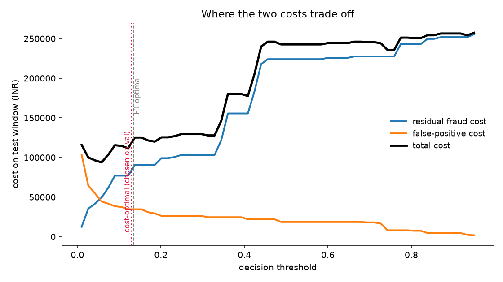

# False-Positive Cost Analysis

What the confusion matrix is worth in money, and whether the recommendation survives being wrong about the inputs.

## Assumptions

**These are assumptions, not measurements.** They are isolated in `CostModel` so that real figures can replace them and the analysis re-run unchanged.

| parameter | value | meaning |
|---|---|---|
| `chargeback_fee` | Rs 500 | acquirer dispute fee per settled fraud |
| `margin_rate` | 25% | contribution margin lost on a blocked sale |
| `friction_cost` | Rs 150 | support and re-auth per wrong decline |
| `churn_probability` | 2% | chance a wrongly blocked customer leaves |
| `customer_ltv` | Rs 8,000 | lifetime value at risk when they do |

A false positive therefore costs `amount x 0.25 + Rs 150 + 0.02 x Rs 8,000` = Rs 310 plus a quarter of the ticket. A settled fraud costs its full amount plus the dispute fee.

**Episode-aware savings.** Flagging the 3rd transaction of an 8-transaction burst prevents 6, not 1 — the decline stops that attempt and the account is frozen behind it. Fraud before the first flag is counted lost; from the first flag onward, prevented.

## Choosing the operating point (validation only)

Sweeping 259 thresholds on the **validation** set and maximising net saving gives **0.1282**, against the F1-optimal **0.1349** carried over from Phase 3.

The test set plays no part in this choice. That is the whole point: a threshold tuned on test would make every Phase 3 number meaningless.

## What each choice costs on the held-out test set

| | F1-optimal | cost-optimal | no model |
|---|---|---|---|
| threshold | 0.1349 | 0.1282 | — |
| transactions flagged | 124 | 125 | 0 |
| false positives | 22 | 22 | 0 |
| fraud txns prevented | 103 | 104 | 0 |
| fraud txns settled | 18 | 17 | 121 |
| **fraud loss avoided** | Rs 898,699 | Rs 912,201 | Rs 0 |
| **false-positive cost** | Rs 34,598 | Rs 34,598 | Rs 0 |
| **residual fraud cost** | Rs 90,520 | Rs 77,018 | Rs 989,219 |
| **total cost** | Rs 125,118 | Rs 111,616 | Rs 989,219 |
| **net saving vs no model** | **Rs 864,101** | **Rs 877,603** | — |

Over 5,865 test transactions covering 11 days of traffic.

**The honest gap.** With hindsight, the best threshold *on test* would have been 0.0691, saving Rs 898,281 -- Rs 20,678 more than the 0.1282 we committed to from validation. That 2.3% shortfall over an 11-day window is the price of not tuning on the test set, and it is the correct price to pay: the retrospective optimum is not available at decision time in production either.

## Cost across the threshold range (test)

| threshold | flagged | false pos | fraud prevented | FP cost | residual fraud | net saving |
|---|---|---|---|---|---|---|
| 0.0500 | 139 | 32 | 109 | Rs 45,051 | Rs 49,278 | Rs 894,890 |
| 0.1000 | 126 | 23 | 104 | Rs 37,501 | Rs 77,018 | Rs 874,700 |
| 0.1349 (F1) | 124 | 22 | 103 | Rs 34,598 | Rs 90,520 | Rs 864,101 |
| 0.1282 (cost) | 125 | 22 | 104 | Rs 34,598 | Rs 77,018 | Rs 877,603 |
| 0.3000 | 113 | 16 | 99 | Rs 26,278 | Rs 103,196 | Rs 859,746 |
| 0.5000 | 95 | 12 | 90 | Rs 18,577 | Rs 224,104 | Rs 746,539 |
| 0.7000 | 92 | 11 | 88 | Rs 18,058 | Rs 227,543 | Rs 743,619 |
| 0.9000 | 78 | 5 | 82 | Rs 4,611 | Rs 251,851 | Rs 732,757 |

## Sensitivity to the assumptions

The net-saving figure is only as good as the guesses above. What matters for a decision is whether the **recommended threshold** moves when those guesses are wrong. Each row re-optimises on validation under a different assumption and reports the resulting test saving.

| scenario | optimal threshold | test net saving |
|---|---|---|
| baseline | 0.1282 | Rs 877,603 |
| chargeback fee 300 (low) | 0.1282 | Rs 856,803 |
| chargeback fee 1000 (high) | 0.1282 | Rs 929,603 |
| margin 10% (thin) | 0.1282 | Rs 894,270 |
| margin 40% (fat) | 0.1282 | Rs 860,937 |
| friction 50 (cheap support) | 0.1282 | Rs 879,803 |
| friction 500 (costly support) | 0.1282 | Rs 869,903 |
| churn 0.5% (sticky) | 0.1282 | Rs 880,243 |
| churn 5% (fickle) | 0.1282 | Rs 872,323 |
| LTV 25,000 (premium) | 0.1282 | Rs 870,123 |

**The optimal threshold does not move at all** — 0.1282 in every one of these scenarios. That looked like a bug when it first appeared, so it was chased down rather than reported as robustness.

The reason is a genuine asymmetry in the economics. The average fraud transaction here is Rs 6,844; a false positive costs Rs 310 plus a quarter of the ticket, so roughly Rs 2,021. Fraud is an order of magnitude more expensive per event, so the optimum is pinned by *which fraud episodes get caught* and is simply not sensitive to false-positive pricing within any plausible range.

### Where it does break

Robustness is only meaningful with a stated limit, so here is the stress test: push false-positive cost up until the operating point moves.

| scenario | FP cost per event | optimal threshold |
|---|---|---|
| baseline | Rs 310 | 0.1282 |
| churn 5%, LTV 25k | Rs 1,400 | 0.1282 |
| churn 10%, LTV 50k | Rs 5,150 | 0.3547 |
| churn 20%, LTV 50k | Rs 10,150 | 0.8324 |
| churn 30%, LTV 100k | Rs 30,150 | 0.9605 |

The operating point holds until a false positive costs roughly **Rs 5,000** — about 73% of the average fraud ticket — at which point it climbs steeply and the detector should be tuned to flag far less. So the honest statement is not *the recommendation is robust*, but: **it is robust provided a wrongly declined customer costs you less than about three-quarters of a fraudulent transaction.** For a payments business that is a comfortable margin; for a high-LTV lender with fragile customer relationships it might not be, and that business should re-run this with its own figures.

Net saving stays positive throughout, which is unsurprising at 2% prevalence with 82% precision. The figure to distrust is the absolute rupee amount, not the sign.

